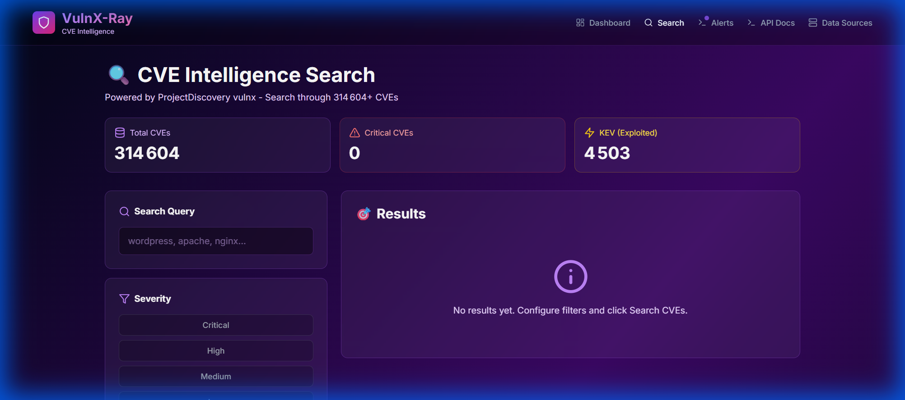
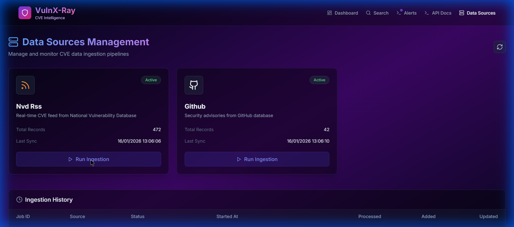

# 🛡️ VulnX-Ray - Advanced CVE Intelligence Platform

<div align="center">


**A powerful, modern vulnerability intelligence platform for security researchers and DevSecOps teams**

[Features](#-features) • [Quick Start](#-quick-start) • [Documentation](#-documentation) • [Architecture](#-architecture) • [Screenshots](#-screenshots)

</div>

---

## 🎯 Overview

**VulnX-Ray** is a comprehensive CVE (Common Vulnerabilities and Exposures) intelligence platform that aggregates, enriches, and provides actionable insights on security vulnerabilities from multiple sources. Built with modern technologies, it provides real-time vulnerability intelligence with advanced search capabilities, automated alerting, and multi-source data ingestion.

### Key Capabilities

- 🔍 **Multi-Source CVE Aggregation**: Ingest from NVD RSS, GitHub Security Advisories, and more
- ⚡ **Powered by ProjectDiscovery**: Leverages `vulnx` CLI for lightning-fast CVE searches across 314,604+ vulnerabilities
- 🎯 **Advanced Filtering**: Search by severity, CVSS score, KEV status, CWE, vendor, and more
- 🔔 **Smart Alerting**: Create custom alerts with keyword monitoring and scheduled checks
- 📊 **Real-time Dashboard**: Live statistics, severity distribution, and trend analysis
- 🚀 **Modern UI**: Beautiful, responsive interface built with Next.js and Tailwind CSS
- 🐳 **Docker-Ready**: Production-ready containerized deployment

---

## ✨ Features

### 🔎 CVE Intelligence Search
- **314,604+ CVE database** powered by ProjectDiscovery's vulnx
- Advanced filters: severity, CVSS score, KEV status, vendor, product
- Real-time search with instant results
- Export results to CSV/JSON formats
- Save and manage search queries

### 📡 Multi-Source Data Ingestion
- **NVD RSS Feed**: National Vulnerability Database real-time updates
- **GitHub Security Advisories**: Direct API integration
- Automated ingestion with scheduling
- Manual trigger support for on-demand updates
- Comprehensive ingestion history and metrics

### 🔔 Automated Alerting System
- Keyword-based monitoring (e.g., "wordpress", "apache")
- Severity-level filtering
- Scheduled alert checks (configurable intervals)
- Email notifications support
- Alert history and audit trail

### 📊 Dashboard & Analytics
- Live CVE count and statistics
- Severity distribution visualization
- Critical CVE highlights
- KEV (Known Exploited Vulnerabilities) tracking
- Trend analysis and insights

### 🔬 Nuclei Integration *(Optional)*
- Automated vulnerability scanning
- Template-based detection
- Scan results management
- Integration with Nuclei's extensive template library

---

## 🚀 Quick Start

### 🐳 Docker Deployment (Recommended)

The fastest way to get VulnX-Ray up and running:

```bash
# Clone the repository
git clone https://github.com/max3825/vulnx-ray.git
cd vulnx-ray

# Start the application
docker compose up -d

# Access the application
# Frontend: http://localhost:3000
# Backend API: http://localhost:8000
# API Docs: http://localhost:8000/docs
```

### 🛠️ Manual Setup

<details>
<summary>Click to expand manual installation steps</summary>

#### Backend Setup

```bash
cd backend
python -m venv venv
source venv/bin/activate  # Windows: venv\Scripts\activate
pip install -r requirements.txt
uvicorn main:app --reload --host 0.0.0.0 --port 8000
```

#### Frontend Setup

```bash
cd frontend
npm install
npm run dev
```

#### Environment Configuration

Create a `.env` file in the backend directory:

```env
PYTHONUNBUFFERED=1
DATABASE_URL=sqlite:///./vulnxray.db
```

</details>

---

## 📸 Screenshots

### CVE Intelligence Search

*Advanced CVE search with real-time filtering and exportation*

### Data Sources Management

*Multi-source CVE ingestion with automated sync*

---

## 🏗️ Architecture

VulnX-Ray follows a modern microservices architecture:

```
┌─────────────────────────────────────────────────────────┐
│                     Frontend (Next.js)                   │
│  ┌──────────┐  ┌──────────┐  ┌──────────┐  ┌─────────┐ │
│  │  Search  │  │Dashboard │  │  Alerts  │  │ Sources │ │
│  └──────────┘  └──────────┘  └──────────┘  └─────────┘ │
└────────────────────┬────────────────────────────────────┘
                     │ REST API
┌────────────────────▼────────────────────────────────────┐
│                  Backend (FastAPI)                       │
│  ┌──────────────┐  ┌──────────────┐  ┌───────────────┐ │
│  │ Search API   │  │ Ingestion    │  │ Alert Engine  │ │
│  │ (vulnx wrap) │  │ Services     │  │               │ │
│  └──────────────┘  └──────────────┘  └───────────────┘ │
└────────────────────┬────────────────────────────────────┘
                     │
        ┌────────────┼────────────┐
        ▼            ▼            ▼
   ┌────────┐  ┌─────────┐  ┌──────────┐
   │ SQLite │  │  vulnx  │  │  NVD RSS │
   │   DB   │  │  Index  │  │  GitHub  │
   └────────┘  └─────────┘  └──────────┘
```

### Components

- **Frontend**: Next.js 14 with App Router, TypeScript, Tailwind CSS
- **Backend**: FastAPI, SQLAlchemy, async/await patterns
- **Database**: SQLite for metadata, vulnx for CVE indexing
- **External Tools**: ProjectDiscovery vulnx, Nuclei (optional)

---

## 📚 Tech Stack

### Backend
- **Framework**: FastAPI 0.104+
- **Language**: Python 3.11+
- **ORM**: SQLAlchemy 2.0
- **Database**: SQLite
- **External CLI**: ProjectDiscovery vulnx, Nuclei
- **HTTP Client**: httpx, Requests
- **Parser**: BeautifulSoup4, feedparser

### Frontend
- **Framework**: Next.js 14 (App Router)
- **Language**: TypeScript 5.3+
- **UI Library**: React 18
- **Styling**: Tailwind CSS 3.4
- **Icons**: Lucide React
- **Charts**: Recharts
- **HTTP Client**: Axios

### DevOps
- **Containerization**: Docker, Docker Compose
- **Process Manager**: Uvicorn (ASGI)
- **Development**: Hot reload, TypeScript type checking

---

## 📖 Documentation

### API Endpoints

#### CVE Search
```http
POST /api/v1/search
Content-Type: application/json

{
  "query": "wordpress",
  "severity": ["critical", "high"],
  "cvss_score_min": 7.0,
  "limit": 50
}
```

#### Data Source Management
```http
GET /api/v1/ingestion/sources
POST /api/v1/ingestion/run/{source_name}
GET /api/v1/ingestion/jobs
```

#### Alerts
```http
GET /api/v1/alerts
POST /api/v1/alerts
PUT /api/v1/alerts/{alert_id}
```

### Interactive API Documentation

- **Swagger UI**: http://localhost:8000/docs
- **ReDoc**: http://localhost:8000/redoc

---

## 🔒 Security & Compliance

VulnX-Ray is designed as a **defensive security tool** for authorized use:

- ✅ Passive reconnaissance only (no active exploitation)
- ✅ Educational and security research purposes
- ✅ Designed for security teams and researchers
- ✅ Complies with responsible disclosure principles
- ✅ No malicious code or exploits included

### ⚠️ Legal Disclaimer

This tool is provided for **educational and defensive security purposes only**. Users must:

- Only access and analyze systems they own or have explicit authorization to test
- Comply with all applicable laws, regulations, and terms of service
- Not use this tool for malicious, unauthorized, or illegal purposes
- Respect responsible disclosure practices

**The developers assume no liability for misuse of this software.**

---

## 🤝 Contributing

Contributions are welcome! Please feel free to submit issues, feature requests, or pull requests.

### Development Setup

1. Fork the repository
2. Create a feature branch: `git checkout -b feature/amazing-feature`
3. Commit your changes: `git commit -m 'Add amazing feature'`
4. Push to the branch: `git push origin feature/amazing-feature`
5. Open a Pull Request

---

## 📝 Roadmap

- [ ] Additional data sources (Vulners, Exploit-DB)
- [ ] Advanced CVE enrichment with EPSS scores
- [ ] Multi-user support with authentication
- [ ] REST API rate limiting and caching
- [ ] Prometheus metrics export
- [ ] Elasticsearch integration for large-scale deployments
- [ ] Webhook support for alert notifications
- [ ] Dark web mention tracking

---

## 📄 License

This project is licensed under the **MIT License** - see the [LICENSE](LICENSE) file for details.

---

## 🙏 Acknowledgments

- [ProjectDiscovery](https://projectdiscovery.io/) for the excellent `vulnx` and `nuclei` tools
- [NVD](https://nvd.nist.gov/) for the National Vulnerability Database
- [GitHub Security Advisories](https://github.com/advisories) for vulnerability data
- [CISA KEV Catalog](https://www.cisa.gov/known-exploited-vulnerabilities-catalog) for KEV tracking

---

<div align="center">

**Made with ❤️ for the security research community**

[](https://github.com/max3825/vulnx-ray)
[](https://github.com/max3825/vulnx-ray/fork)

</div>
